# Minimart POS Developer Guide

This guide explains the custom ERPNext/Frappe app `minimart_pos` in a way that is easy to present during a code walkthrough or thesis defense. The app provides a cashier-friendly POS page for a minimart or sari-sari store, while still using ERPNext's standard POS documents for accounting, stock, opening shifts, closing shifts, and consolidation.

Use this document as both a developer onboarding manual and a presentation guide. New developers should start with the architecture and folder structure, then read the frontend and backend flow together. For a recommended reading path, see [Code Reading Order](#10-code-reading-order).

## 1. App Overview

`minimart_pos` is a custom Frappe app that adds a custom Desk page called **Mart POS**. The page is optimized for fast retail checkout: item search, barcode scanning, cart editing, customer selection, full payment, partial payment, utang, held sales, recent transactions, and POS shift closing.

The important design choice is that the app does not create its own accounting document. Checkout creates a standard ERPNext **POS Invoice**. Because it uses ERPNext documents, the sale can still participate in ERPNext's normal POS lifecycle:

- **POS Profile** supplies the company, warehouse, default customer, selling price list, payment methods, and change account.
- **POS Opening Entry** starts the cashier shift and records opening balances per Mode of Payment.
- **POS Invoice** records each checkout transaction, including items, payment rows, paid amount, outstanding amount, and status.
- **POS Closing Entry** collects the shift's POS Invoices and prepares payment reconciliation.
- **Sales Invoice consolidation** happens through ERPNext's POS closing and merge process.
- **Item**, **Item Price**, **Item Barcode**, **Product Bundle**, **Bin**, and **Warehouse** are used for product display, barcode lookup, pricing, UOMs, bundles, and stock availability.
- **Customer** is used for normal customer selection and utang credit validation.
- **Mode of Payment** rows come from the POS Profile, so the payment methods in Mart POS follow ERPNext configuration.

In short: Mart POS is the user interface and orchestration layer; ERPNext remains the accounting and stock engine.

### 1.1 Architecture Overview

Mart POS follows a layered architecture. The cashier works in a custom Desk page, but all business records are still ERPNext records.

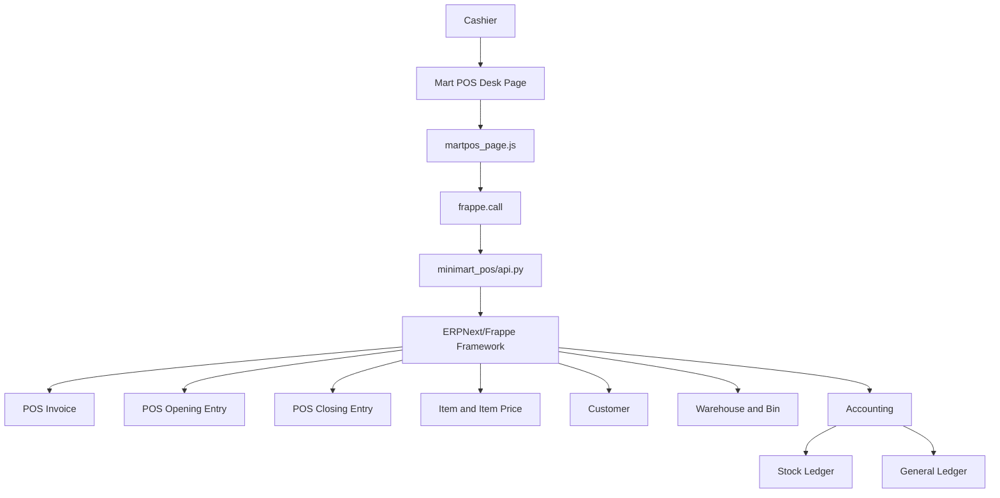

Layer responsibilities:

| Layer | Responsibility | Why it exists |
| --- | --- | --- |
| Cashier | Performs store operations: scan, search, add to cart, receive payment, hold sale, close shift. | Keeps the workflow focused on real counter operations. |
| `martpos_page.js` | Controls the custom POS user interface and calls backend methods. | Gives a faster and simpler UI than navigating many ERPNext forms. |
| `frappe.call()` | Sends browser requests to whitelisted Python methods. | Provides the standard Frappe RPC bridge between JavaScript and Python. |
| `api.py` | Validates requests and creates/reads ERPNext documents. | Keeps trusted business logic on the server. |
| ERPNext/Frappe | Runs document validation, permissions, naming, submit lifecycle, stock/accounting behavior, and closing logic. | Avoids duplicating ERPNext's accounting and stock engine. |
| ERPNext DocTypes | Store actual transactions, master data, stock, and accounting records. | Makes Mart POS compatible with standard ERPNext reports and workflows. |

The key architectural rule is: **custom UI, native ERPNext documents**.

### 1.2 Request Lifecycle

This is the normal request lifecycle when the cashier completes checkout:

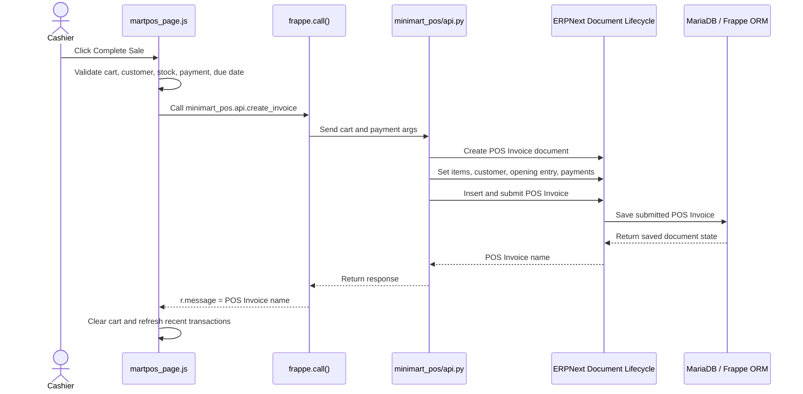

Step-by-step explanation:

1. The cashier clicks **Complete Sale** in the checkout dialog.
2. The JavaScript checks the cart, selected customer, stock display, payment method, paid amount, and due date.
3. The frontend sends a `frappe.call()` request to `minimart_pos.api.create_invoice`.
4. The backend receives trusted server-side data and re-validates important rules.
5. `api.py` creates a real ERPNext `POS Invoice`.
6. ERPNext runs document methods like missing value setup, taxes and totals, insert, validate, and submit.
7. The backend returns the submitted POS Invoice name.
8. The UI clears the cart and reloads Recent Transactions from the current open shift.

### 1.3 Application Startup Flow

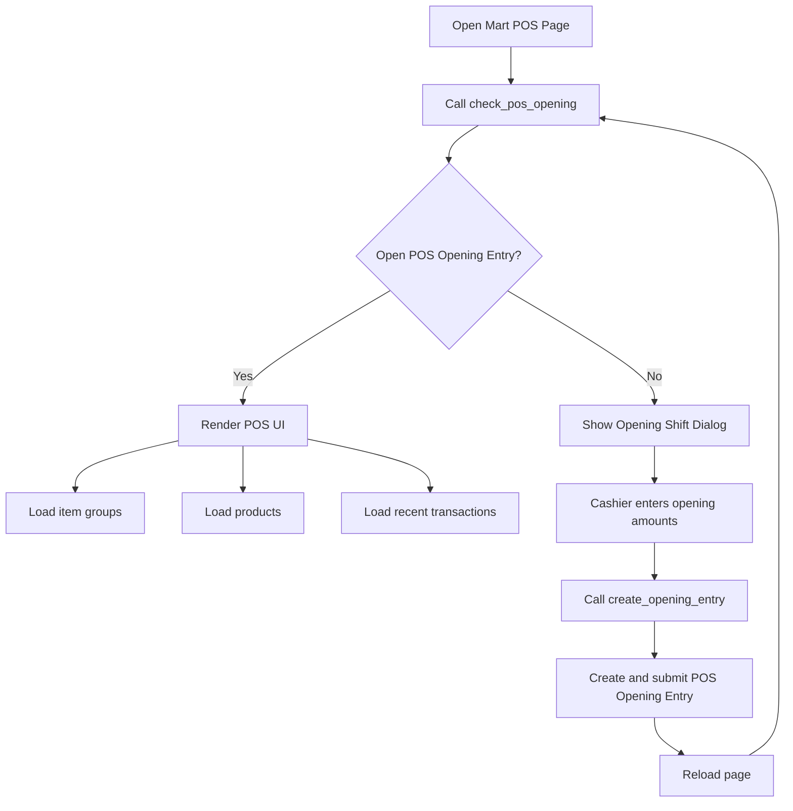

Why this flow matters:

- Mart POS should not allow checkout without an open submitted shift.
- Opening amounts must follow the POS Profile payment methods.
- Reloading after shift opening gives the page fresh `shift_data`, including opening entry, profile, customer, warehouse, and payment methods.

**Key Takeaways**

- Mart POS is a custom UI over standard ERPNext POS documents.
- The browser is responsible for speed and interaction; `api.py` is responsible for trusted business logic.
- Checkout, opening, closing, and recent transactions all depend on the active POS Profile and POS Opening Entry.

> **Presentation Tips**
>
> What to say: "This project does not replace ERPNext accounting. It improves the cashier interface while preserving ERPNext's POS document lifecycle."
>
> Common question: "Why not create a custom invoice DocType?"
>
> Short answer: "Because ERPNext already provides tested accounting, stock, POS closing, and consolidation logic through POS Invoice and POS Closing Entry."

## 2. Folder Structure

Important files and folders in `apps/minimart_pos/`:

| Path | Purpose |
| --- | --- |
| `README.md` | Basic app readme generated for the custom app. |
| `TODO.md` | Local development notes. |
| `license.txt` | App license file. |
| `pyproject.toml` | Python project and tooling metadata. |
| `minimart_pos/__init__.py` | Package marker for the Python app. |
| `minimart_pos/api.py` | Main backend API. Most POS logic lives here. |
| `minimart_pos/hooks.py` | Frappe hook configuration. Currently mostly scaffold/default comments plus app metadata. |
| `minimart_pos/modules.txt` | Frappe modules file. Currently empty. |
| `minimart_pos/patches.txt` | Frappe patches file. Currently no active patches. |
| `minimart_pos/public/.gitkeep` | Placeholder for public static assets. No active public assets are currently used. |
| `minimart_pos/templates/` | Standard Frappe template package folders. No custom website page logic is currently implemented. |
| `minimart_pos/minimart_pos/page/martpos_page/` | Custom Desk page files for Mart POS. |
| `minimart_pos/minimart_pos/page/martpos_page/martpos_page.js` | Main frontend controller for the POS page. |
| `minimart_pos/minimart_pos/page/martpos_page/martpos_page.html` | HTML template rendered into the Desk page. |
| `minimart_pos/minimart_pos/page/martpos_page/martpos_page.css` | CSS for the Mart POS interface. |
| `minimart_pos/minimart_pos/page/martpos_page/martpos_page.json` | Frappe Page metadata. Page name is `martpos_page`, title is `Mart POS`, and role access is currently `System Manager`. |
| `minimart_pos/minimart_pos/doctype/mart_pos_held_sale/` | Custom DocType used to store suspended carts. |
| `minimart_pos/minimart_pos/doctype/mart_pos_held_sale/mart_pos_held_sale.json` | DocType schema for held sales. |
| `minimart_pos/minimart_pos/doctype/mart_pos_held_sale/mart_pos_held_sale.py` | Python controller for the held sale DocType. Currently minimal. |

There are no custom reports or print formats in the inspected app. Receipt printing uses ERPNext/Frappe print view for the standard `POS Invoice` document.

### 2.1 Folder Responsibilities

| Folder | Purpose | Responsibilities | Typical contents | Safe to modify | Modify carefully |
| --- | --- | --- | --- | --- | --- |
| `apps/minimart_pos/` | App root. | Stores project metadata, docs, license, and Python package. | `README.md`, `pyproject.toml`, `docs/`, `minimart_pos/`. | Documentation and app-level notes. | Tooling metadata if the bench depends on it. |
| `apps/minimart_pos/docs/` | Developer documentation. | Explains architecture, flows, and maintenance notes. | Markdown manuals. | Yes. | Keep synchronized with code. |
| `apps/minimart_pos/minimart_pos/` | Main Python package. | Contains backend API, hooks, modules, public assets, templates. | `api.py`, `hooks.py`, `modules.txt`, `public/`. | Small backend changes with tests. | Checkout, payment, closing, and ERPNext integration logic. |
| `apps/minimart_pos/minimart_pos/public/` | Public static asset area. | Holds static files served under app assets if needed. | Currently only `.gitkeep`. | Add assets when required. | Asset paths may require `bench build`. |
| `apps/minimart_pos/minimart_pos/templates/` | Website template package. | Frappe website page/templates location. | Empty package markers. | Add website templates if needed. | Not involved in Desk POS unless intentionally connected. |
| `apps/minimart_pos/minimart_pos/minimart_pos/page/` | Frappe Desk Page module. | Stores custom page code. | `martpos_page/`. | Page UI work. | Checkout and recent transaction action mapping. |
| `apps/minimart_pos/minimart_pos/minimart_pos/page/martpos_page/` | Mart POS page implementation. | Defines page metadata, template, styling, and JavaScript controller. | `.js`, `.html`, `.css`, `.json`. | UI layout and display behavior. | Payment dialog, route targets, reprint, closing, held sale actions. |
| `apps/minimart_pos/minimart_pos/minimart_pos/doctype/` | Custom DocType module. | Holds custom data models. | `mart_pos_held_sale/`. | Add future app DocTypes. | Existing schema changes need migration awareness. |
| `apps/minimart_pos/minimart_pos/minimart_pos/doctype/mart_pos_held_sale/` | Held Sale DocType. | Stores suspended carts. | JSON schema and Python controller. | Add fields for held-sale-only needs. | `completed_invoice` links to the completed POS Invoice. |

### 2.2 File Responsibilities

| File | Purpose | Who calls it | Who it calls | Dependencies | ERPNext objects used | Risk |
| --- | --- | --- | --- | --- | --- | --- |
| `minimart_pos/api.py` | Main backend API and business integration. | `martpos_page.js` through `frappe.call()`. | Frappe ORM, ERPNext POS Invoice, POS Closing helpers, Customer helpers. | `frappe`, `erpnext`, `frappe.utils`. | POS Profile, POS Opening Entry, POS Invoice, POS Closing Entry, Item, Item Price, Customer, Warehouse, Bin, Product Bundle. | High. |
| `minimart_pos/hooks.py` | App metadata and optional Frappe hooks. | Frappe app loader. | No active custom hooks in current file. | Frappe hook system. | None directly. | Low now, higher if hooks are enabled. |
| `minimart_pos/modules.txt` | Declares Frappe modules. | Frappe module loader. | None. | Frappe app metadata. | None. | Low. |
| `minimart_pos/patches.txt` | Lists migration patches. | `bench migrate`. | Patch modules if added. | Frappe migration system. | Depends on patch. | Medium if used. |
| `martpos_page.js` | Main browser controller. | Frappe Desk page runtime. | `minimart_pos.api.*`, `frappe.client.get_list`, Frappe routing and dialog APIs. | Browser, jQuery, Frappe JS. | Customer Link field, Item Group, POS Invoice route/print. | High. |
| `martpos_page.html` | Page template. | `frappe.render_template("martpos_page")`. | DOM IDs used by JS. | Frappe template rendering. | None directly. | Medium. |
| `martpos_page.css` | UI styling. | Desk page asset loader. | Browser CSS. | CSS/Bootstrap classes. | None directly. | Low to medium. |
| `martpos_page.json` | Frappe Page metadata. | Frappe Desk route loader. | Page JS/template. | Frappe Page DocType. | Page role permissions. | Medium. |
| `mart_pos_held_sale.json` | Held Sale schema. | Frappe DocType system. | Database table generation. | Frappe ORM. | Customer, User, POS Invoice link field. | Medium. |
| `mart_pos_held_sale.py` | Held Sale DocType controller. | Frappe document lifecycle. | Currently minimal. | Frappe model controller. | Mart POS Held Sale. | Low currently. |

**Key Takeaways**

- The app is intentionally compact: most business logic is in `api.py`, most UI behavior is in `martpos_page.js`, and suspended carts are stored in `Mart POS Held Sale`.
- The nested `minimart_pos/minimart_pos/` path is normal for a Frappe app: the outer package contains app code, while the inner module contains Frappe modules such as pages and DocTypes.
- Folder and file risk increases when a file affects checkout, payments, stock, closing, or ERPNext document submission.

> **Presentation Tips**
>
> What to say: "The project has a small surface area. That makes it easier to maintain, but it also means `api.py` and `martpos_page.js` are high-impact files."
>
> Common question: "Where should a new developer start?"
>
> Short answer: "Start with the page JavaScript to understand the cashier workflow, then read `api.py` to see how those UI actions become ERPNext documents. See [Code Reading Order](#10-code-reading-order)."

## 3. Backend Explanation: `minimart_pos/api.py`

`api.py` contains whitelisted methods called from `martpos_page.js` and helper functions used by those methods. The backend's main responsibility is to translate the custom POS UI actions into valid ERPNext documents.

### 3.1 Backend Function Reference

Functions marked **Critical** affect checkout, accounting, closing, or data integrity.

| Function | Importance | Purpose | Caller | Return value | ERPNext DocTypes used | Database interaction | Validation and exceptions | Why it exists |
| --- | --- | --- | --- | --- | --- | --- | --- | --- |
| `get_assigned_pos_profile()` | **Critical** | Gets POS Profile assigned to current user. | Most backend functions. | `POS Profile` doc. | POS Profile User, POS Profile. | Reads assigned profile. | Throws if no profile is assigned. | Centralizes active POS configuration. |
| `check_pos_opening()` | **Critical** | Checks current open submitted shift. | Page load in JS. | Shift/profile dictionary. | POS Opening Entry, POS Profile. | Reads open shift and payment methods. | Throws indirectly if no profile. | Decides whether UI should load POS or opening dialog. |
| `create_opening_entry(pos_profile, amounts)` | **Critical** | Creates and submits POS Opening Entry. | Opening dialog. | Opening Entry name. | POS Opening Entry, POS Profile. | Inserts/submits opening entry. | Frappe document validation can throw. | Starts a cashier shift using POS Profile methods. |
| `get_products(...)` | Important | Loads product grid data. | `load_products()`. | List of products. | Item, Item Price, Bin, Product Bundle. | SQL read and stock reads. | Requires assigned POS Profile. | Gives the custom UI its catalog. |
| `get_item_by_barcode(barcode)` | Important | Finds item by barcode or item code. | Scan input Enter. | Product row or `None`. | Item Barcode, Item. | Reads barcode/item/catalog. | Returns `None` when not found. | Supports scanner-first cashier flow. |
| `search_item(query)` | Important | Finds first item by search text. | Barcode fallback. | Product row or `None`. | Item, Item Price. | Reads catalog. | Empty query returns `None`. | Supports manual search. |
| `get_item_uoms_and_prices(item_code, price_list)` | Important | Loads UOM choices and prices. | `add_to_cart()`. | UOM price list. | Item, Item Price. | Reads Item and Item Price. | Empty item returns empty list. | Allows UOM switching in cart. |
| `add_item_price_history(...)` | Medium | Saves new selling price. | Price modal. | Updated UOM/price payload. | Item, Item Price. | Updates old price validity and inserts new price. | Throws if item missing or price negative. | Lets cashier maintain prices from POS. |
| `hold_sale(...)` | Important | Saves suspended cart. | Hold Sale button. | Held Sale name. | Mart POS Held Sale, POS Profile. | Inserts or updates held sale. | Throws for empty cart, invalid owner/profile/status. | Suspends a cart without stock/accounting impact. |
| `get_held_sales()` | Medium | Lists active held sales. | Held Sales dialog. | Held sale summary list. | Mart POS Held Sale. | Reads held sales. | Requires assigned POS Profile. | Lets cashier manage suspended carts. |
| `get_held_sale(name)` | Medium | Loads one held cart. | Resume held sale. | Held sale cart payload. | Mart POS Held Sale. | Reads held sale. | Throws if not Held or wrong cashier. | Restores a suspended sale safely. |
| `mark_held_sale_completed(...)` | Medium | Marks held sale completed after checkout. | `create_invoice()`. | None. | Mart POS Held Sale. | Updates held sale. | Throws if wrong cashier. | Prevents completed held sale from staying active. |
| `delete_held_sales(names)` | Medium | Deletes selected held sales. | Held Sales dialog. | Deleted count payload. | Mart POS Held Sale. | Deletes allowed held sales. | Only deletes current cashier/profile held rows. | Cleanup for suspended carts. |
| `delete_all_held_sales()` | Medium | Deletes all current cashier/profile held sales. | Held Sales dialog. | Deleted count payload. | Mart POS Held Sale. | Deletes allowed held sales. | Restricted to current cashier/profile. | Bulk cleanup. |
| `get_utang_credit_details(...)` | Important | Computes credit limit and projected outstanding. | Utang helpers. | Credit details dictionary. | Customer. | Reads customer credit/outstanding through ERPNext helpers. | Throws for Guest or invalid customer. | Supports safe utang decisions. |
| `get_utang_credit_status(customer, amount)` | Important | Whitelisted utang status wrapper. | Payment dialog. | Credit details dictionary. | Customer, POS Profile. | Reads profile and customer outstanding. | Throws if invalid customer through helper. | Gives frontend live credit status. |
| `validate_utang_credit(...)` | **Critical** | Enforces utang credit limit server-side. | `create_invoice()`. | Credit details or throw. | Customer. | Reads customer outstanding. | Throws when credit exceeded. | Prevents bypassing frontend validation. |
| `create_invoice(...)` | **Critical** | Creates and submits POS Invoice. | `submit_payment()`. | POS Invoice name. | POS Invoice, POS Opening Entry, POS Profile, Item, Customer. | Inserts/submits POS Invoice and updates held sale. | Throws for no open shift, invalid payment/due date/utang/ERPNext validation. | Heart of backend checkout. |
| `reconcile_pos_invoice_payments(...)` | **Critical** | Aligns payment rows, paid amount, change, and outstanding. | `create_invoice()`. | None. | POS Invoice payments child table. | Mutates document before insert/submit. | Throws when selected MOP is not in POS Profile, except Utang. | Bridges custom server checkout with ERPNext POS behavior. |
| `set_normal_pos_sale_item_fields(...)` | **Critical** | Keeps item rows as normal sales. | `create_invoice()`. | None. | POS Invoice Item. | Mutates item row. | None directly. | Prevents consolidation from treating sales as transfers. |
| `get_recent_invoices(opening_entry)` | Important | Returns current-shift POS Invoices only. | `load_recent_orders()`. | List of transaction dictionaries. | POS Opening Entry, POS Invoice. | SQL query on POS Invoice. | Returns empty for invalid/no shift. | Powers Recent Transactions without Sales Invoice names. |
| `get_recent_orders(opening_entry)` | Medium | Backward-compatible alias. | Older or direct frontend calls. | Same as `get_recent_invoices()`. | POS Opening Entry, POS Invoice. | Delegates to recent invoice query. | Returns empty when no open shift. | Avoids breaking callers using old method name. |
| `validate_shift_stock(opening_entry)` | **Critical** | Checks stock before closing shift. | `close_pos_shift()`. | None. | POS Invoice, POS Invoice Item, Bin, Product Bundle. | Reads selected POS invoices and stock bins. | Throws `NegativeStockError` if stock insufficient. | Gives a clearer close-shift failure before ERPNext submit. |
| `close_pos_shift(opening_entry)` | **Critical** | Creates POS Closing Entry from opening. | Close Shift button. | POS Closing Entry name. | POS Opening Entry, POS Closing Entry, POS Invoice. | Inserts closing entry. | Throws if shift already closed or stock validation fails. | Hands off shift closing to ERPNext native logic. |
| `void_invoice(invoice_name)` | Low | Blocks direct voiding. | Legacy or future UI actions. | Always throws. | POS Invoice. | None. | Always throws "Void Not Allowed". | Prevents unsafe cancellation from custom UI. |

Common backend exception sources:

- Missing POS Profile assignment.
- No open submitted POS Opening Entry.
- Invalid or empty cart data.
- Payment mode not configured in POS Profile.
- Missing due date for partial payment or utang.
- Customer credit limit exceeded.
- Negative stock during checkout or closing.
- ERPNext document validation during insert/submit.

### POS Profile and Shift APIs

#### `get_assigned_pos_profile()`

Purpose: Finds the `POS Profile` assigned to the current `frappe.session.user`.

Parameters: None.

Returns: A `POS Profile` document.

DocTypes used: `POS Profile User`, `POS Profile`.

Frontend use: Indirectly used by almost every backend API to know the active POS profile, company, warehouse, price list, default customer, and payment methods.

#### `check_pos_opening()`

Purpose: Checks whether the current user has an open submitted POS shift for the assigned POS Profile.

Parameters: None.

Returns: A dictionary containing `opening_entry`, `pos_profile`, `company`, default `customer`, `payment_methods`, `warehouse`, `cashier`, and `opening_time`.

DocTypes used: `POS Opening Entry`, `POS Profile`.

Frontend use: Called on page load. If no opening entry exists, the frontend shows the Open Shift dialog. If one exists, it renders the POS UI.

#### `create_opening_entry(pos_profile, amounts=None)`

Purpose: Creates and submits a new `POS Opening Entry`.

Parameters:

- `pos_profile`: POS Profile name.
- `amounts`: Optional dictionary of Mode of Payment to opening amount.

Returns: The created POS Opening Entry name.

DocTypes used: `POS Opening Entry`, `POS Profile`.

Frontend use: Called from the Open Shift dialog. The dialog creates one opening amount field per POS Profile payment method.

#### `close_pos_shift(opening_entry)`

Purpose: Creates a `POS Closing Entry` from the current opening entry and returns it for review/submission.

Parameters:

- `opening_entry`: POS Opening Entry name.

Returns: POS Closing Entry name.

DocTypes used: `POS Opening Entry`, `POS Closing Entry`, `POS Invoice`, `Bin`, stock-related tables.

ERPNext methods reused:

- `make_closing_entry_from_opening(opening_doc)`
- `get_pos_invoices(start, end, pos_profile, user)` inside `validate_shift_stock()`

Frontend use: Called by the Close Shift button. The frontend routes the cashier to the created POS Closing Entry form.

### Product, Barcode, UOM, and Price APIs

#### `get_products(search_term=None, item_group=None, limit_page_length=20, in_stock_only=True)`

Purpose: Loads saleable products for the product grid. It supports searching, item group filtering, stock filtering, UOM prices, and product bundle availability.

Parameters:

- `search_term`: Text entered in the search/barcode box.
- `item_group`: Optional Item Group filter.
- `limit_page_length`: Maximum products returned.
- `in_stock_only`: Whether to hide out-of-stock items.

Returns: List of product rows with item code, item name, image, group, UOM, conversion factor, price, actual quantity, and bundle metadata.

DocTypes/tables used: `Item`, `Item Price`, `UOM Conversion Detail`, `Bin`, `Product Bundle`, `Product Bundle Item`.

Frontend use: Called during page initialization, search typing, group filter change, and after cart actions that need stock display refresh.

#### `get_item_by_barcode(barcode)`

Purpose: Finds an item from an `Item Barcode` value, falling back to direct Item code lookup.

Parameters:

- `barcode`: Scanned or typed barcode/item code.

Returns: One enriched product row or `None`.

DocTypes used: `Item Barcode`, `Item`, `Bin`, `Product Bundle`.

Frontend use: Called when the cashier presses Enter in the scan field.

#### `search_item(query)`

Purpose: Finds the first matching POS item by exact item code, barcode, item name, or partial search.

Parameters:

- `query`: Search text.

Returns: One enriched product row or `None`.

Frontend use: Fallback after barcode lookup fails.

#### `get_item_uoms_and_prices(item_code, price_list=None)`

Purpose: Returns the stock UOM and alternate UOMs for an item, with the latest valid Item Price for each UOM.

Parameters:

- `item_code`: Item code.
- `price_list`: Optional price list. Defaults to selling settings or the POS profile price list through callers.

Returns: List of UOM rows with UOM, conversion factor, stock UOM flag, and price.

DocTypes used: `Item`, child table `Item UOM`, `Item Price`.

Frontend use: Called when adding an item to the cart so the cashier can switch UOMs.

#### `add_item_price_history(item_code, uom=None, price=0, price_list=None)`

Purpose: Saves a new current selling price by closing the previous valid `Item Price` row and inserting a new one.

Parameters: Item code, UOM, price, optional price list.

Returns: Updated price details and refreshed UOM price list.

DocTypes used: `Item`, `Item Price`, `POS Profile`.

Frontend use: Called from the Set Item Price modal.

### Stock and Bundle Helpers

These helpers are not directly called by the frontend but support product loading and shift validation:

- `get_stock_qty_map(item_codes, warehouse)` reads `Bin` quantities in bulk.
- `get_available_qty(item_code, warehouse)` uses ERPNext POS Invoice stock availability logic.
- `is_active_product_bundle(item_code)`, `get_bundle_components()`, `get_active_bundle_names()`, `get_bundle_component_map()`, and `get_bundle_available_qty()` calculate bundle availability from component stock.
- `validate_shift_stock(opening_entry)` checks the POS invoices selected by ERPNext's closing logic and fails early if closing the shift would create negative stock.

### Customer and Utang APIs

#### `get_utang_credit_details(customer, company, amount=0)`

Purpose: Computes whether a customer can use utang based on credit limit and current outstanding balance.

Parameters:

- `customer`: Customer name.
- `company`: Company.
- `amount`: New sale amount to add to outstanding.

Returns: Customer, credit limit, current outstanding, projected outstanding, available credit, and allowed flag.

DocTypes/ERPNext methods used: `Customer`, `get_credit_limit()`, `get_customer_outstanding()`.

Frontend use: Indirectly through `get_utang_credit_status()`.

#### `get_utang_credit_status(customer, amount=0)`

Purpose: Whitelisted wrapper that uses the assigned POS Profile company and returns utang status.

Frontend use: Called when selecting Utang in checkout and before submitting an utang sale.

#### `validate_utang_credit(customer, company, amount)`

Purpose: Server-side enforcement for utang credit rules. It throws if the customer is not allowed to use utang for the sale amount.

Frontend use: Not called directly. Used inside `create_invoice()`.

### Held Sale APIs

Held sales are suspended carts. They do not create accounting or stock entries until they are checked out.

#### `hold_sale(cart, customer=None, grand_total=0, remarks=None, held_sale_name=None)`

Purpose: Creates or updates a `Mart POS Held Sale`.

Parameters: JSON cart, customer, grand total, remarks, optional existing held sale name.

Returns: Held sale name.

DocTypes used: `Mart POS Held Sale`, `POS Profile`.

Frontend use: Called by Hold Sale.

#### `get_held_sales()`

Purpose: Lists active held sales for the current cashier, company, and warehouse.

Returns: Up to 50 held sales with name, customer, total, created date, remarks, and item count.

Frontend use: Called by the Held Sales dialog.

#### `get_held_sale(name)`

Purpose: Loads one held sale and returns its cart data for restoring into the POS cart.

Frontend use: Called when resuming a held sale.

#### `mark_held_sale_completed(held_sale_name, invoice_name=None)` and `complete_held_sale(...)`

Purpose: Marks a held sale as completed after checkout.

DocTypes used: `Mart POS Held Sale`.

Important note: The held sale schema has `completed_invoice` linked to `POS Invoice`, because Mart POS checkout creates and submits ERPNext POS Invoice records.

#### `delete_held_sales(names)` and `delete_all_held_sales()`

Purpose: Deletes held sales that belong to the current cashier, company, and warehouse.

Frontend use: Called from the Held Sales management dialog.

### Checkout and Payment APIs

#### `create_invoice(cart, customer=None, mode_of_payment="Cash", amount_paid=0, total_payable=None, held_sale_name=None, payment_due_date=None)`

Purpose: Creates, inserts, and submits a standard ERPNext `POS Invoice` from the Mart POS cart.

Parameters:

- `cart`: JSON list of cart items.
- `customer`: Selected customer or default POS Profile customer.
- `mode_of_payment`: Selected Mode of Payment, including `Utang`.
- `amount_paid`: Cash/payment amount received. For Utang this becomes zero.
- `total_payable`: Frontend total after UI-level discount.
- `held_sale_name`: Optional held sale to mark completed.
- `payment_due_date`: Required when the invoice has outstanding balance.

Returns: POS Invoice name.

DocTypes used: `POS Profile`, `POS Opening Entry`, `POS Invoice`, `Item`, `Customer`, `Mart POS Held Sale`.

Important behavior:

1. It verifies that a submitted open POS Opening Entry exists for the current user and POS Profile.
2. It creates a new `POS Invoice`.
3. It links the invoice to `pos_opening_entry`.
4. It sets customer, company, posting date, due date, warehouse, and POS flags.
5. It appends item rows from the cart.
6. It calls `set_missing_values()` so ERPNext initializes standard POS fields and payment rows from the POS Profile.
7. It calls `set_normal_pos_sale_item_fields()` for every item row so normal sales are not treated as internal transfers.
8. It calculates taxes and totals.
9. It validates partial payment or utang due date rules.
10. It validates utang credit when needed.
11. It calls `reconcile_pos_invoice_payments()` before insert and again before submit.
12. It submits the POS Invoice and marks the held sale completed if applicable.

Frontend use: Called by `submit_payment()` in `martpos_page.js`.

#### `reconcile_pos_invoice_payments(invoice, mode_of_payment, received_amount)`

Purpose: Aligns Mart POS payment rows with ERPNext POS Invoice behavior before submit.

Parameters:

- `invoice`: POS Invoice document.
- `mode_of_payment`: Selected payment method.
- `received_amount`: Actual paid amount.

Returns: None. It mutates the invoice document.

DocTypes used: POS Invoice child table `payments`.

ERPNext methods reused:

- `invoice.set_paid_amount()`

Important behavior:

- It does not create duplicate payment rows.
- It uses the payment rows already initialized from the POS Profile.
- It sets the selected payment method amount to the entered amount.
- It sets other payment method amounts to zero.
- For `Utang`, no configured payment row is required and paid amount remains zero.
- It uses null-safe values for optional fields like `total_advance`, `write_off_amount`, and `base_write_off_amount`.
- It sets `outstanding_amount` so partial payment and utang remain outstanding instead of becoming fully paid.

This function exists because the Mart POS frontend creates POS Invoices server-side, while ERPNext native POS normally performs part of the payment/outstanding calculation in the native POS client before saving/submitting.

#### `set_normal_pos_sale_item_fields(item, warehouse)`

Purpose: Ensures POS Invoice item rows represent normal sales, not internal transfers.

Parameters:

- `item`: POS Invoice Item row.
- `warehouse`: POS Profile warehouse.

Behavior:

- Sets `warehouse`.
- Clears `target_warehouse`.
- Sets `delivered_by_supplier = 0`.
- Clears sales order and delivery note link fields.

Why this matters: If `target_warehouse` is accidentally set, ERPNext Sales Invoice consolidation may validate the row as an internal transfer and fail with "Target Warehouse is mandatory for internal transfers."

### Recent Transaction APIs

#### `get_recent_invoices(opening_entry=None)`

Purpose: Returns recent current-shift `POS Invoice` records only.

Parameters:

- `opening_entry`: Optional POS Opening Entry name. If missing, the API finds the current open shift for the current user and assigned POS Profile.

Returns: List of POS Invoice rows with:

- `doctype`
- `name`
- `pos_invoice_name`
- `display_id`
- `customer`
- `grand_total`
- `paid_amount`
- `outstanding_amount`
- `status`
- `posting_date`
- `posting_time`
- return metadata

DocTypes used: `POS Opening Entry`, `POS Invoice`, `POS Profile`.

Filtering:

- `docstatus = 1`
- matching `pos_profile`
- `consolidated_invoice` is empty
- posting datetime is between opening entry `period_start_date` and now
- owner is opening entry user when the opening user matches the current session user

Frontend use: Called by `load_recent_orders()`.

#### `get_recent_orders(opening_entry=None)`

Purpose: Backward-compatible alias for recent transactions.

Returns: Same list as `get_recent_invoices()`.

Important note: This used to be a source of bugs when older frontend code assumed Sales Invoice names. Current behavior should return real POS Invoice names.

### Void/Reprint APIs

#### `void_invoice(invoice_name)`

Purpose: Explicitly prevents voiding a submitted POS Invoice from Mart POS.

Returns: It always throws a message telling the user to use Return Sale instead.

Reprint does not use a backend API. The frontend opens Frappe print view for `doctype=POS Invoice` and `name=<POS Invoice name>`.

**Key Takeaways**

- Backend functions exist to keep trusted ERPNext operations on the server.
- `create_invoice()` is the main checkout bridge between the browser cart and ERPNext POS Invoice.
- `reconcile_pos_invoice_payments()` exists because Mart POS creates POS Invoices server-side and must align payment totals before submit.
- `close_pos_shift()` intentionally reuses ERPNext's closing helper instead of manually selecting and consolidating invoices.

> **Presentation Tips**
>
> What to say: "The backend is not a separate POS accounting engine. It is an adapter that converts Mart POS actions into ERPNext-native documents."
>
> Common question: "Why is `reconcile_pos_invoice_payments()` needed?"
>
> Short answer: "ERPNext native POS prepares payment and outstanding values before saving. Mart POS creates invoices server-side, so this helper keeps server-created invoices aligned with native POS behavior."

## 4. Frontend Explanation: `martpos_page.js`

`martpos_page.js` is the main UI controller for the Mart POS Desk page.

### 4.1 Frontend Function Reference

| Function/method | Purpose | Events handled | Backend APIs called | State changes | DOM updates | When it executes |
| --- | --- | --- | --- | --- | --- | --- |
| `frappe.pages["martpos_page"].on_page_load` | Creates Desk page and checks shift. | Page load. | `check_pos_opening`. | None directly. | Creates Frappe page. | When route opens. |
| `show_opening_dialog(shift_data)` | Displays shift opening dialog. | Open Shift primary action. | `create_opening_entry`. | None until reload. | Renders opening amount fields. | When no open shift exists. |
| `render_pos_ui(page, shift_data)` | Renders POS template and page buttons. | Page button clicks. | None directly. | Creates `window.pos_instance`. | Appends POS HTML. | After open shift is confirmed. |
| `MiniMartPOS.constructor` | Initializes page state and selectors. | None. | None. | Sets cart, shift data, dialog state, cached selectors. | None. | When POS UI is rendered. |
| `init()` | Starts POS page behavior. | None. | Product/recent APIs through child methods. | Initializes controls. | Loads products/recent list. | Immediately after constructor. |
| `setup_customer_control()` | Creates Customer Link field and Guest button. | Customer change, Guest click. | None. | Updates selected customer. | Renders customer control. | During `init()`. |
| `bind_events()` | Wires scanner, search, checkout, clear cart. | Keypress, input, change, document click, checkout click. | Product and item APIs through child methods. | May update cart/search. | Focuses scanner and refreshes product grid. | During `init()`. |
| `load_item_groups()` | Loads Item Group filter. | None. | `frappe.client.get_list` for Item Group. | None. | Appends dropdown options. | During `init()`. |
| `load_products()` | Loads product cards. | Search typing, group change, refreshes. | `get_products`. | None. | Calls `render_products()`. | During startup and search/filter changes. |
| `render_products(products)` | Displays product cards. | Product card click uses inline add handler. | None. | None. | Replaces product grid HTML. | After product API returns. |
| `fetch_item(query)` | Barcode/item lookup. | Enter in scan input. | `get_item_by_barcode`. | Adds item through callback. | May refresh cart. | Scanner workflow. |
| `search_item(query)` | Fallback manual search. | Barcode miss/search. | `search_item`. | Adds item if found. | Shows not found alert if needed. | After barcode lookup fails. |
| `add_to_cart(item)` | Adds item and UOM data to cart. | Product click or scan success. | `get_item_uoms_and_prices`. | Mutates `this.cart`, UOM cache. | Refreshes cart and stock display. | When item is selected. |
| `render_cart()` | Renders cart rows and totals. | UOM change events. | None. | None. | Replaces cart table, count, total. | After cart changes. |
| `open_item_price_modal()` | Allows manual item price update. | Save Price click. | `add_item_price_history`. | Updates item price and UOM cache. | Refreshes cart and product grid. | Price button click. |
| `open_item_discount_modal()` | Applies line discount. | Apply click. | None. | Updates cart line discount. | Refreshes cart. | Discount button click. |
| `get_checkout_stock_issues()` | Checks cart quantity against visible stock. | Checkout click. | None. | None. | None, returns issue list. | Before payment dialog opens. |
| `process_payment()` | Opens checkout/payment dialog. | Complete Sale action. | Utang API through child methods. | Sets current payment total. | Renders payment modal. | Checkout button click. |
| `attach_payment_listeners()` | Wires numpad, quick cash, discount, MOP buttons. | Button clicks, input, Enter key. | None directly. | Updates current total/payment UI. | Updates change/due date display. | When payment dialog opens. |
| `handle_payment_method_change()` | Handles Cash/GCash/Utang switching. | MOP button click. | `get_utang_credit_status` for Utang. | Sets `current_utang_allowed`. | Shows/hides credit status and disables amount input for Utang. | During checkout. |
| `update_payment_ui()` | Updates change and due date visibility. | Numpad/input/MOP/discount changes. | None. | None. | Updates payable, change, due date area. | During checkout dialog edits. |
| `validate_utang_credit()` | Final frontend utang check. | Complete Sale for Utang. | `get_utang_credit_status`. | None. | Shows error dialog if not allowed. | Before submit for Utang. |
| `submit_payment()` | Sends checkout to backend. | Complete Sale. | `create_invoice`. | Clears cart and held sale state after success. | Refreshes cart and recent transactions. | Final checkout step. |
| `load_recent_orders()` | Loads current shift transactions. | Startup and checkout success. | `get_recent_invoices`. | None. | Shows loading/transaction list. | During init and after sale. |
| `render_recent_orders()` | Renders recent transaction cards. | Card click, reprint click. | None. | None. | Replaces recent transaction list. | After recent API returns. |
| `show_transaction_menu()` | Shows actions for POS Invoice. | View/Reprint clicks. | None. | None. | Opens action dialog. | Recent transaction card click. |
| `reprint_receipt()` | Opens print view for POS Invoice. | Reprint click. | None. | None. | Opens print window. | Recent transaction action. |
| `hold_sale()` | Saves current cart as held sale. | Hold Sale action. | `hold_sale`. | Clears cart and active held sale. | Refreshes cart/products. | Hold Sale button. |
| `show_held_sales()` | Opens held sale manager. | Held Sales button. | `get_held_sales`. | Sets held sale cache. | Opens dialog. | Held Sales button. |
| `restore_held_sale()` | Restores one held cart. | Resume selected. | `get_held_sale`. | Replaces cart and active held sale. | Refreshes cart and stock. | Held sale resume. |
| `close_shift()` | Creates POS Closing Entry. | Close Shift button. | `close_pos_shift`. | None. | Routes to POS Closing Entry form. | End of cashier shift. |

### Page Initialization

When `martpos_page` loads:

1. Frappe creates a Desk app page with title `Mart POS`.
2. The frontend calls `minimart_pos.api.check_pos_opening`.
3. If no open shift exists, it shows `show_opening_dialog()`.
4. If an open shift exists, it calls `render_pos_ui(page, shift_data)`.
5. `render_pos_ui()` renders the HTML template and creates `window.pos_instance = new MiniMartPOS(...)`.
6. It adds page buttons for Open Drawer, Hold Sale, Held Sales, and Close Shift.

### Item Loading and Search

The `MiniMartPOS` class controls the page.

Important methods:

- `load_item_groups()` loads non-group `Item Group` records for the filter dropdown.
- `load_products()` calls `minimart_pos.api.get_products`.
- `render_products()` displays product cards with image, stock badge, UOM, and price.
- `fetch_item()` calls `get_item_by_barcode`.
- `search_item()` calls `search_item` as fallback.
- `handle_fetched_item()` adds the result to cart and plays feedback sound.

Barcode scanning is handled by listening for Enter in the scan input. The same input also refreshes the product grid while typing.

### Cart Management

Important methods:

- `add_to_cart()` loads UOM/price data, merges matching non-discounted cart lines, and refreshes stock.
- `render_cart()` displays cart rows with quantity controls, UOM selector, price button, discount button, and remove button.
- `update_qty()` and `manual_qty_update()` change quantity.
- `change_cart_item_uom()` changes UOM and price.
- `open_item_price_modal()` updates Item Price through the backend.
- `open_item_discount_modal()` applies line discount percentage.
- `void_cart_item()` removes one cart line.
- `clear_cart()` clears the whole cart after confirmation.
- `get_checkout_stock_issues()` prevents checkout if the cart needs more stock than currently displayed.

### Customer Selection

`setup_customer_control()` creates a Frappe Link field to `Customer` and a Guest button. The default comes from the active POS Profile. Utang requires a registered customer because credit limit and outstanding balance are customer-based.

### Checkout and Payment Dialog

`process_payment()` opens the checkout dialog. It validates:

- Cart is not empty.
- Customer is selected.
- Stock is enough for checkout.

The dialog contains:

- Total payable display.
- Amount received input and numpad.
- Discount controls.
- Payment method buttons from POS Profile.
- Utang credit status area.
- Due date field for partial payment or utang.
- Quick cash buttons.
- Change display.

Payment methods are rendered from `shift_data.payment_methods`, which comes from the POS Profile. The frontend should not hard-code Cash, GCash, or other modes.

`submit_payment()` calls `minimart_pos.api.create_invoice` with cart, customer, selected mode of payment, amount received, payable total, held sale name, and due date. After successful checkout it clears the cart and refreshes recent transactions.

### Partial Payment and Utang Behavior

Full payment:

- Cashier selects a payment method and enters an amount equal to or greater than the payable total.
- Backend sets that payment row amount.
- POS Invoice paid amount equals the entered amount.
- Outstanding amount is zero.

Partial payment:

- Cashier enters less than the payable total.
- Due date is required.
- Backend keeps only the actual paid amount in payment rows.
- POS Invoice remains outstanding for the unpaid balance.

Utang:

- Cashier selects `Utang`.
- Amount received is forced to zero.
- Due date is required.
- Frontend checks credit status.
- Backend validates credit again.
- POS Invoice has paid amount zero and outstanding amount equal to the sale total.

### Opening Shift Flow

`show_opening_dialog()` displays cashier, POS Profile, company, opening date, and one opening amount field per payment method. It calls `create_opening_entry()` and reloads the page after success.

### Closing Shift Flow

`close_shift()` confirms with the cashier, calls `close_pos_shift()`, then routes to the created `POS Closing Entry`. The cashier can review and submit it using ERPNext's standard form.

### Recent Transactions

`load_recent_orders()` calls `minimart_pos.api.get_recent_invoices` using the current opening entry.

`render_recent_orders()` displays current-shift POS Invoices only. Each card stores:

- `data-doctype="POS Invoice"`
- `data-pos-name="<full ACC-PSINV name>"`

The display may show a short ID like `#00154`, but actions use the full POS Invoice name.

Labels are calculated from paid and outstanding amounts:

- Outstanding zero: Paid.
- Paid amount greater than zero and outstanding greater than zero: Partly Paid with outstanding amount.
- Paid amount zero and outstanding greater than zero: Unpaid with outstanding amount.

`show_transaction_menu()` opens a dialog titled `Transaction ACC-PSINV-...`.

`View Invoice` uses:

```javascript
frappe.set_route("Form", "POS Invoice", pos_invoice_name);
```

`Reprint Receipt` opens Frappe print view using:

```text
doctype=POS Invoice
name=<full POS Invoice name>
```

Return Sale and Receive Payment are currently disabled/not available from recent POS Invoice transactions.

### Held Sales

Held sales let the cashier suspend a cart without creating a POS Invoice.

Important methods:

- `hold_sale()` saves the current cart through `minimart_pos.api.hold_sale`.
- `show_held_sales()` loads held sales.
- `render_held_sales_dialog()` displays the management dialog.
- `restore_held_sale()` loads a held sale back into the cart.
- Delete selected/all actions call backend delete APIs.

**Key Takeaways**

- `martpos_page.js` owns the cashier experience: loading products, managing the cart, opening dialogs, and routing to ERPNext forms.
- The frontend performs convenience validation, but the backend remains the final authority.
- Recent transaction actions must always use the full `pos_invoice_name`, never a display ID or Sales Invoice name.

> **Presentation Tips**
>
> What to say: "The frontend is optimized for cashier speed. It keeps the interface simple while delegating permanent records to the backend."
>
> Common question: "Can users bypass frontend validation?"
>
> Short answer: "Yes, browser validation can be bypassed, so `api.py` repeats critical checks before creating or submitting ERPNext documents."

## 5. Full Transaction Flow

### 5.1 Complete Business Flow Diagrams

### Flowchart: Open Shift

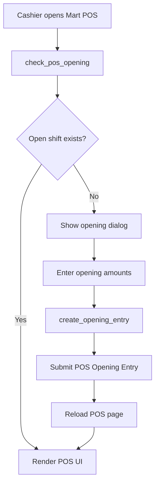

### Flowchart: Barcode Scan

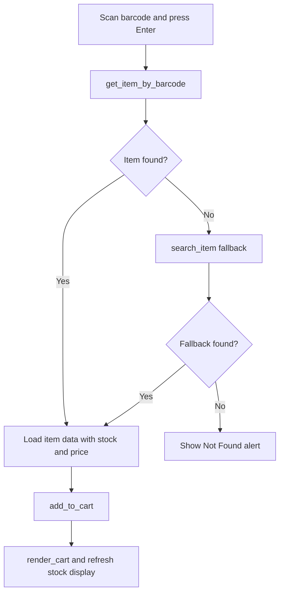

### Flowchart: Search Item

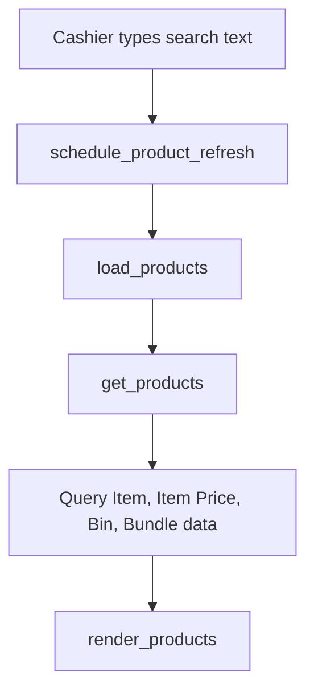

### Flowchart: Add Item

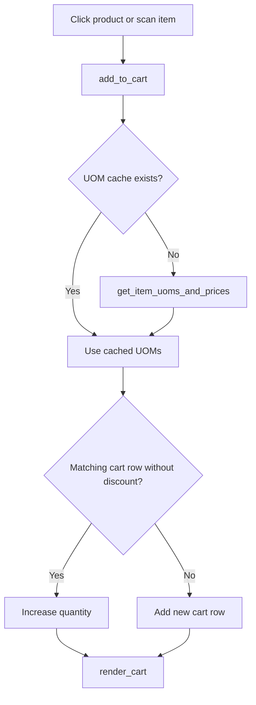

### Flowchart: Checkout

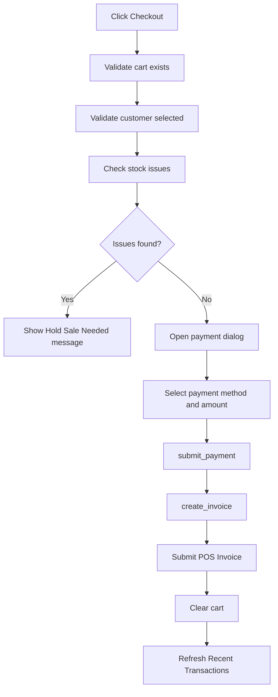

### Flowchart: Full Payment

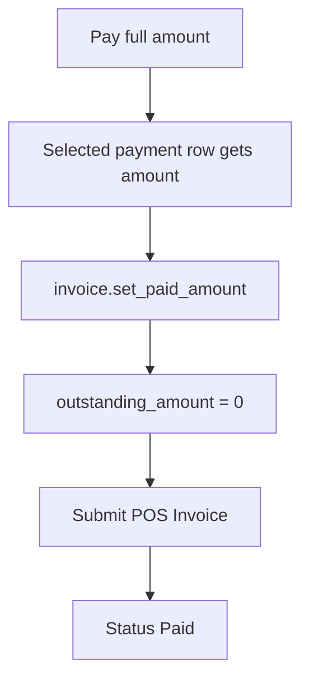

### Flowchart: Partial Payment

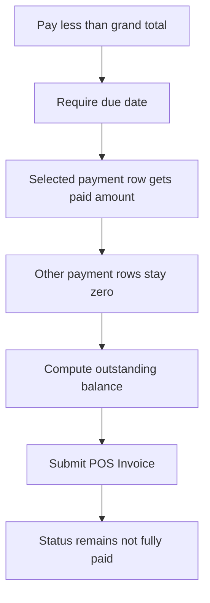

### Flowchart: Utang

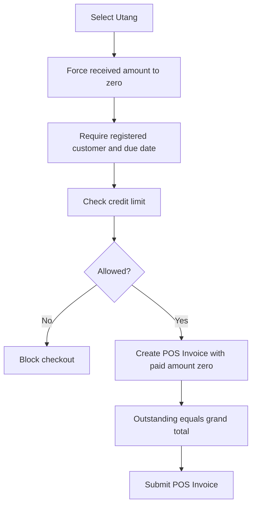

### Flowchart: Recent Transactions

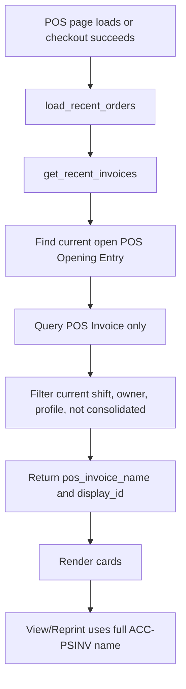

### Flowchart: Held Sale

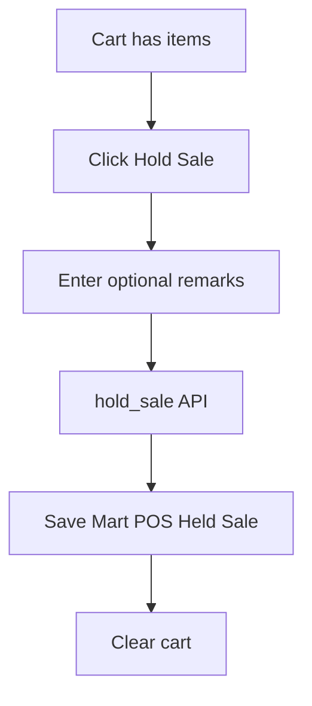

### Flowchart: Resume Held Sale

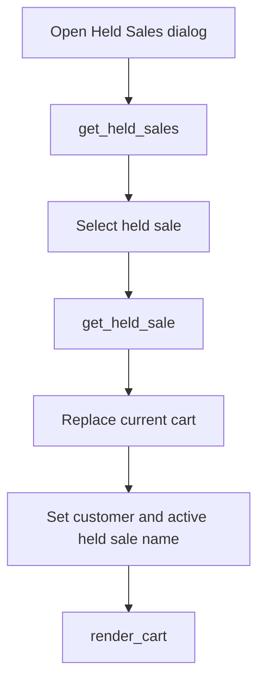

### Flowchart: Close Shift

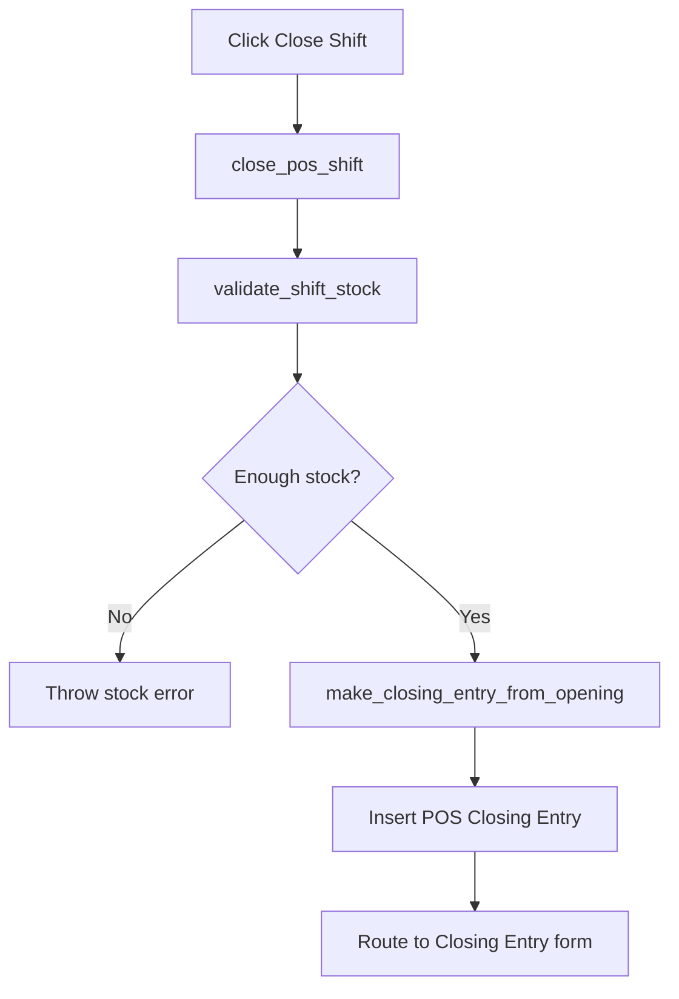

### Flowchart: Sales Invoice Consolidation

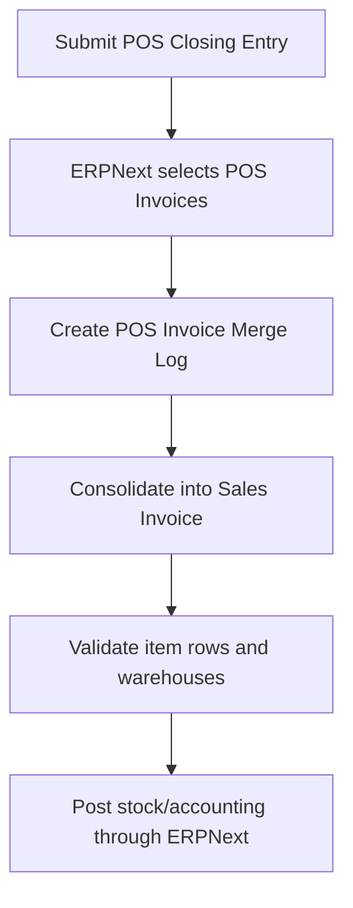

### Open Shift

1. Cashier opens Mart POS.
2. Frontend calls `check_pos_opening()`.
3. If no open shift exists, frontend shows the opening dialog.
4. Cashier enters opening amounts for each POS Profile payment method.
5. Frontend calls `create_opening_entry()`.
6. Backend creates and submits a `POS Opening Entry`.
7. Page reloads and the POS UI appears.

### Add Item to Cart

1. Cashier scans barcode, searches, or clicks a product card.
2. Frontend calls `get_item_by_barcode()`, `search_item()`, or uses loaded product data.
3. Frontend calls `get_item_uoms_and_prices()` if needed.
4. Item is added to cart.
5. Cart total and stock badges refresh.

### Checkout Full Payment

1. Cashier clicks checkout.
2. Frontend validates cart, customer, and stock.
3. Cashier selects payment method and enters full amount.
4. Frontend calls `create_invoice()`.
5. Backend creates a `POS Invoice`, lets ERPNext initialize payment rows, sets the selected row amount, and submits it.
6. POS Invoice result: paid amount equals sale total, outstanding is zero, status is Paid.
7. Frontend clears cart and refreshes recent transactions.

### Checkout Partial Payment

1. Cashier enters amount received lower than payable total.
2. Frontend requires due date.
3. Frontend calls `create_invoice()`.
4. Backend sets only actual paid amount on selected payment row.
5. Backend sets POS Invoice outstanding amount for the balance.
6. POS Invoice result: paid amount is partial amount, outstanding is remaining balance, status is not Paid according to ERPNext behavior.

### Checkout Utang

1. Cashier selects `Utang`.
2. Amount received is forced to zero.
3. Frontend checks customer credit status.
4. Due date is required.
5. Backend validates credit again.
6. Backend creates a POS Invoice with zero paid amount and full outstanding balance.
7. POS Invoice result: paid amount zero, outstanding equals grand total, status is Unpaid according to ERPNext behavior.

### Recent Transaction Display

1. After checkout, frontend calls `load_recent_orders()`.
2. Backend queries `POS Invoice` directly for the current opening shift.
3. Backend returns real POS Invoice names as `pos_invoice_name`.
4. Frontend shows a short display ID but routes and prints using the full `ACC-PSINV-...` name.

### Close Shift

1. Cashier clicks Close Shift.
2. Frontend calls `close_pos_shift(opening_entry)`.
3. Backend validates stock using ERPNext's selected POS Invoices for that shift.
4. Backend calls ERPNext `make_closing_entry_from_opening()`.
5. Frontend routes to the generated `POS Closing Entry`.
6. Cashier reviews and submits in ERPNext.

### POS Closing Entry Submission and Sales Invoice Consolidation

When the POS Closing Entry is submitted, ERPNext consolidates the selected POS Invoices into a Sales Invoice through its standard POS merge process. Mart POS must ensure its POS Invoice rows look like normal ERPNext POS sale rows:

- Item `warehouse` should be the POS Profile warehouse.
- `target_warehouse` should be empty.
- `delivered_by_supplier` should be zero.
- Sales Order and Delivery Note link fields should be empty unless the sale is actually linked.

This is why `set_normal_pos_sale_item_fields()` exists.

For lower-level implementation details behind these flows, cross-reference [Backend Function Reference](#31-backend-function-reference), [Frontend Function Reference](#41-frontend-function-reference), and [Checkout Pipeline](#63-checkout-pipeline).

**Key Takeaways**

- Every cashier action follows a predictable browser-to-backend-to-ERPNext flow.
- Full payment, partial payment, and utang all use the same POS Invoice creation pipeline; only the payment amount and outstanding balance differ.
- Shift closing and Sales Invoice consolidation are ERPNext workflows. Mart POS prepares valid POS Invoices and then hands control back to ERPNext.

> **Presentation Tips**
>
> What to say: "The project can be explained as a set of business flows: open shift, sell, optionally hold a sale, review recent POS Invoices, and close the shift."
>
> Common question: "Where does Sales Invoice creation happen?"
>
> Short answer: "Not during checkout. Checkout creates POS Invoices. ERPNext handles Sales Invoice consolidation during POS Closing Entry submission."

## 6. Important ERPNext Concepts

### POS Profile

Configuration for a POS counter. Mart POS uses it for company, warehouse, customer, price list, payment methods, and change account. A user must be assigned to a POS Profile through `POS Profile User`.

### POS Invoice

The main transaction document created by checkout. It records sold items, totals, payment rows, paid amount, outstanding amount, status, and stock/accounting behavior.

### POS Opening Entry

Represents the start of a cashier shift. Mart POS requires a submitted open POS Opening Entry before checkout. Recent transactions are filtered using the opening entry's start time, user, and POS Profile.

### POS Closing Entry

Represents the end of a cashier shift. ERPNext uses it to collect POS Invoices, reconcile expected and closing amounts, and consolidate POS Invoices.

### Mode of Payment

Payment method such as Cash or GCash. Mart POS reads payment methods from the POS Profile and does not create duplicate payment rows.

### Warehouse

The stock location used for POS sales. Mart POS uses the POS Profile warehouse for item availability and POS Invoice item rows.

### Stock Ledger

ERPNext's stock movement ledger. POS Invoice and closing/consolidation must have valid item warehouse data so stock validation and posting work correctly.

### General Ledger

ERPNext's accounting ledger. POS Invoice payment and outstanding fields must be correct so ERPNext posts paid and receivable amounts correctly.

### Sales Invoice Consolidation

ERPNext can consolidate POS Invoices into a Sales Invoice during closing. Mart POS should not replace this process. It should create valid POS Invoices and let ERPNext perform standard consolidation.

### 6.1 Frappe Communication

Mart POS uses Frappe's normal browser-to-server communication model.

### How `frappe.call()` works

`frappe.call()` is a JavaScript helper that sends an HTTP request from the browser to a Python method. In Mart POS, this is used for operations such as loading products, opening shifts, creating invoices, holding sales, and closing shifts.

Typical pattern:

```javascript
frappe.call({
    method: "minimart_pos.api.create_invoice",
    args: {
        cart: JSON.stringify(cart_payload),
        customer: customer,
        mode_of_payment: selected_mop
    },
    callback: (r) => {
        // r.message contains the Python return value
    }
});
```

### How `@frappe.whitelist()` works

Python functions must be decorated with `@frappe.whitelist()` before they can be called from the browser. This is why functions such as `check_pos_opening()`, `create_opening_entry()`, `get_products()`, `create_invoice()`, and `close_pos_shift()` are whitelisted.

Whitelisting does not mean the function is automatically safe. The backend must still validate important rules because browser data can be modified by a user.

### How responses are returned

When a whitelisted Python function returns a value, Frappe sends it back to JavaScript inside `r.message`.

Examples:

- `create_invoice()` returns a POS Invoice name.
- `get_products()` returns a list of product dictionaries.
- `check_pos_opening()` returns shift/profile data.
- `get_recent_invoices()` returns recent POS Invoice rows.

### Frontend and backend responsibilities

| Responsibility | Frontend | Backend |
| --- | --- | --- |
| Fast cashier interaction | Yes | No |
| Dialogs, buttons, cart rendering | Yes | No |
| Trustworthy validation | Partial convenience checks | Yes |
| Database reads/writes | Through API only | Yes |
| ERPNext document creation | No | Yes |
| Accounting and stock correctness | No | ERPNext/backend |

### 6.2 ERPNext Integration Strategy

This app intentionally reuses ERPNext documents instead of creating custom accounting documents.

Reasons:

- ERPNext already implements POS accounting, stock, taxes, GL, and closing behavior.
- Standard reports expect standard ERPNext documents.
- POS Closing Entry and Sales Invoice consolidation rely on ERPNext document fields.
- Reusing POS Invoice reduces maintenance risk.
- Future ERPNext users can inspect transactions in familiar forms.

Integration summary:

| ERPNext object | How Mart POS uses it |
| --- | --- |
| POS Profile | Source of company, warehouse, customer, price list, payment methods, and change account. |
| POS Opening Entry | Required open shift before checkout; used for recent transaction filtering and closing. |
| POS Invoice | Main checkout document. Stores items, totals, payment rows, paid amount, outstanding amount, and status. |
| POS Closing Entry | Created from the open shift using ERPNext's closing helper. |
| Sales Invoice | Created by ERPNext consolidation after POS Closing Entry submission, not by Mart POS checkout. |
| Customer | Selected in UI and used for utang credit validation. |
| Item | Product catalog source. |
| Item Price | Price source and update target for manual price changes. |
| Warehouse | POS Profile warehouse used for stock availability and invoice item rows. |
| Mode of Payment | Payment rows come from POS Profile configuration. |
| Stock Ledger | Updated by ERPNext according to submitted/consolidated POS behavior. |
| General Ledger | Updated by ERPNext accounting lifecycle. |

### 6.3 Checkout Pipeline

Checkout is the most important flow in the app because it converts a temporary browser cart into an ERPNext accounting document.

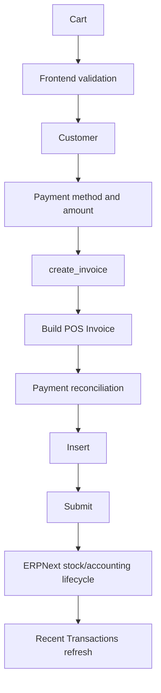

Pipeline details:

1. **Cart**: The browser stores item code, quantity, UOM, price, and discount.
2. **Validation**: The frontend checks obvious issues, but the backend remains the trusted layer.
3. **Customer**: Customer is sent to the backend. Utang requires a registered customer.
4. **Payment**: Selected Mode of Payment and amount paid are sent to the backend.
5. **`create_invoice()`**: This is the heart of the backend. It creates the ERPNext POS Invoice.
6. **Payment reconciliation**: `reconcile_pos_invoice_payments()` sets payment row amounts and outstanding amount.
7. **Insert and submit**: ERPNext validates and submits the POS Invoice.
8. **Stock and accounting**: ERPNext document lifecycle handles the real stock/accounting effect.
9. **Recent refresh**: The UI reloads current-shift POS Invoices.

Why `create_invoice()` is the heart of the backend:

- It connects the cart to ERPNext.
- It enforces open shift requirements.
- It selects the correct POS Profile and warehouse.
- It validates partial payment and utang due dates.
- It calls ERPNext document lifecycle methods.
- It prevents custom UI behavior from bypassing accounting rules.

**Key Takeaways**

- ERPNext DocTypes are the backbone of the app. Mart POS should not duplicate stock or accounting logic that ERPNext already owns.
- `frappe.call()` and `@frappe.whitelist()` are the communication bridge between `martpos_page.js` and `api.py`.
- `create_invoice()` is the most important integration point because it converts a temporary cart into a submitted POS Invoice.

> **Presentation Tips**
>
> What to say: "The strongest part of the design is ERPNext integration. The app is custom where the cashier needs speed, and standard where accounting needs correctness."
>
> Common question: "What happens to stock and accounting?"
>
> Short answer: "Those effects are handled by ERPNext's document lifecycle through POS Invoice, POS Closing Entry, Stock Ledger, and General Ledger integration."

## 7. Common Bugs Fixed Recently

### POS Invoice Outstanding Amount Stayed Zero

Symptom: Sale total was 800, cash paid was 500, but outstanding amount stayed zero and status became Paid.

Cause: Mart POS created server-side POS Invoices but was missing part of the native ERPNext POS payment/outstanding preparation that normally happens before save/submit.

Fix: `reconcile_pos_invoice_payments()` now reuses `invoice.set_paid_amount()` and sets outstanding amount using ERPNext-aligned fields after payment row amounts are set.

Lesson learned: When building a custom POS UI, do not assume `submit()` alone reproduces every browser-side ERPNext POS calculation. Inspect native ERPNext POS flow and reuse its methods where possible.

### Partial and Utang Invoices Became Paid

Symptom: Partial payment and utang were treated like fully paid invoices.

Cause: Payment totals were not being reconciled in the same way as ERPNext POS before submit.

Fix: Only the selected Mode of Payment row receives the actual amount. Other rows remain zero. Utang keeps paid amount zero. Outstanding amount remains for the unpaid balance.

Lesson learned: Payment rows, `paid_amount`, and `outstanding_amount` must agree before submit.

### Payment Mode Mapping Issues

Symptom: Payment rows could become duplicated or the wrong payment method could receive the amount.

Root cause: Custom code must not manually invent POS Invoice payment rows when ERPNext already initializes them from POS Profile.

Fix: `reconcile_pos_invoice_payments()` uses existing payment rows, sets the selected row amount, and sets non-selected rows to zero.

Lesson learned: The POS Profile is the source of truth for payment methods.

### POS Closing Entry Target Warehouse Error

Symptom: Closing submit failed during consolidation with "Row 1: Target Warehouse is mandatory for internal transfers."

Cause: POS Invoice item rows could contain transfer-related fields that made ERPNext validation treat a normal sale like an internal transfer.

Fix: `set_normal_pos_sale_item_fields()` clears `target_warehouse`, sales order links, delivery note links, and supplier delivery flags for normal POS sale items.

Lesson learned: Item child table fields matter during consolidation. A field that looks harmless during checkout can trigger a different ERPNext validation path later.

### POS Closing Entry Submission Issues

Symptom: Closing Entry could be created, but submit failed later during ERPNext consolidation or stock validation.

Root cause: Closing uses ERPNext's selected POS Invoices and performs validations beyond the Mart POS checkout screen.

Fix: `close_pos_shift()` now creates the closing entry through ERPNext's helper, and `validate_shift_stock()` checks selected POS invoices before closing.

Lesson learned: Closing must stay aligned with ERPNext's own POS Closing Entry logic.

### Recent Transactions Showed Sales Invoice Instead of POS Invoice

Symptom: Recent transaction dialog or View Invoice used `ACC-SINV-...` even though the real document was `ACC-PSINV-...`.

Cause: Older frontend mapping derived or replaced invoice names and treated recent transactions like Sales Invoices.

Fix: Backend now returns `pos_invoice_name` and `display_id` separately. Frontend uses the full `pos_invoice_name` for dialog title, routing, and reprint.

Lesson learned: Display IDs and document names are not the same thing. Never derive the document name from a shortened display label.

### Current-Shift Filtering for Recent Transactions

Symptom: Recent Transactions showed old or consolidated transactions, or became empty when helper filters did not match Mart-created invoices.

Cause: Recent transaction filtering needed to match the current POS Opening Entry, POS Profile, user, and posting datetime.

Fix: `get_recent_invoices()` queries `POS Invoice` directly using current shift filters and excludes consolidated invoices.

Lesson learned: Recent Transactions should represent the cashier's current open shift, not all invoices in the system.

**Key Takeaways**

- Most serious bugs came from mismatches between custom UI assumptions and ERPNext's native POS document lifecycle.
- Payment correctness depends on payment rows, `paid_amount`, `change_amount`, and `outstanding_amount` staying synchronized.
- Closing and consolidation bugs often appear later than checkout, so testing must include POS Closing Entry submission, not just POS Invoice creation.

> **Presentation Tips**
>
> What to say: "These bugs show why we inspected ERPNext's native POS behavior instead of guessing. The fixes moved the custom app closer to ERPNext's standard lifecycle."
>
> Common question: "What was the hardest bug?"
>
> Short answer: "The partial payment issue, because payment rows looked correct but outstanding amount and status still behaved as if the invoice were fully paid."

## 8. Developer Notes

### Files Safe to Modify for POS Logic

Usually safe:

- `minimart_pos/api.py` for backend POS behavior.
- `minimart_pos/minimart_pos/page/martpos_page/martpos_page.js` for frontend interaction.
- `minimart_pos/minimart_pos/page/martpos_page/martpos_page.html` for page structure.
- `minimart_pos/minimart_pos/page/martpos_page/martpos_page.css` for page styling.
- `minimart_pos/minimart_pos/doctype/mart_pos_held_sale/` for held sale schema/controller changes.

Handle carefully:

- `create_invoice()` because it affects accounting, stock, payment rows, outstanding amount, and closing.
- `reconcile_pos_invoice_payments()` because it affects paid/outstanding behavior.
- `set_normal_pos_sale_item_fields()` because it affects consolidation.
- `close_pos_shift()` and `validate_shift_stock()` because they must stay aligned with ERPNext closing behavior.
- Recent transaction name mapping because POS Invoice names must not be converted to Sales Invoice names.

Avoid unless necessary:

- Recreating ERPNext accounting formulas manually.
- Manually creating POS Invoice payment rows that ERPNext already initializes from POS Profile.
- Changing checkout UI when the issue is backend document lifecycle.
- Changing opening/closing shift behavior when fixing unrelated cart, item, or recent transaction issues.

### Validation Commands

Run Python syntax validation:

```bash
python3 -m py_compile apps/minimart_pos/minimart_pos/api.py
```

Run JavaScript syntax validation:

```bash
node --check apps/minimart_pos/minimart_pos/minimart_pos/page/martpos_page/martpos_page.js
```

### Cache and Bench Restart

After changing backend Python or Frappe metadata:

```bash
bench --site <site-name> clear-cache
bench restart
```

During development, if the browser still shows old JavaScript:

```bash
bench build --app minimart_pos
bench --site <site-name> clear-cache
```

Then hard refresh the browser.

### Manual Test Checklist

Full payment:

1. Open a new POS shift.
2. Add item with total 800.
3. Pay 800.
4. Confirm POS Invoice paid amount is 800, outstanding is zero, status is Paid.
5. Confirm recent transaction opens `POS Invoice` with `ACC-PSINV-...`.

Partial payment:

1. Add item with total 800.
2. Pay 500 and set due date.
3. Confirm paid amount is 500 and outstanding is 300.
4. Confirm status is not Paid according to ERPNext behavior.
5. Confirm recent transaction label shows partly paid/outstanding.

Utang:

1. Select a registered customer with enough credit limit.
2. Add item with total 800.
3. Select Utang and set due date.
4. Confirm paid amount is zero and outstanding is 800.
5. Confirm recent transaction label shows unpaid/outstanding.

Closing shift:

1. Create full payment, partial payment, and utang POS Invoices.
2. Click Close Shift.
3. Open the generated POS Closing Entry.
4. Confirm expected amounts include actual paid amounts only.
5. Submit the POS Closing Entry.
6. Confirm ERPNext creates/consolidates Sales Invoice records without target warehouse errors.

Recent transactions:

1. Hard refresh after code changes.
2. Open a new shift.
3. Confirm recent transactions are empty for the new shift.
4. Make a partial sale and an utang sale.
5. Confirm both cards route to `POS Invoice` names like `ACC-PSINV-...`.
6. Close/submit shift.
7. Open a new shift and confirm old shift transactions no longer appear.

**Key Takeaways**

- Treat checkout, payment reconciliation, item warehouse fields, recent transaction mapping, and closing as high-risk areas.
- Always run syntax checks after code changes and manually test full payment, partial payment, utang, recent transactions, and closing.
- When debugging, verify the ERPNext document fields, not only what the custom UI displays.

> **Presentation Tips**
>
> What to say: "The developer workflow focuses on protecting ERPNext compatibility. Small changes can affect accounting, stock, or closing, so we validate both code syntax and business flows."
>
> Common question: "What should be tested before deployment?"
>
> Short answer: "At minimum: full payment, partial payment, utang, recent transaction routing/reprint, POS Closing Entry submit, and Sales Invoice consolidation."

## 9. Developer Cheat Sheet

### Important Files

| File | Use this when |
| --- | --- |
| `apps/minimart_pos/minimart_pos/api.py` | Backend POS logic, invoice creation, shift handling, recent transaction API, held sales. |
| `apps/minimart_pos/minimart_pos/minimart_pos/page/martpos_page/martpos_page.js` | Frontend behavior, cart, checkout dialog, recent transaction actions, held sale UI. |
| `apps/minimart_pos/minimart_pos/minimart_pos/page/martpos_page/martpos_page.html` | POS page structure and DOM IDs. |
| `apps/minimart_pos/minimart_pos/minimart_pos/page/martpos_page/martpos_page.css` | POS page styling. |
| `apps/minimart_pos/minimart_pos/minimart_pos/page/martpos_page/martpos_page.json` | Frappe Page metadata and role access. |
| `apps/minimart_pos/minimart_pos/minimart_pos/doctype/mart_pos_held_sale/mart_pos_held_sale.json` | Held Sale schema. |
| `apps/minimart_pos/minimart_pos/hooks.py` | App metadata and Frappe hooks. |

### Important Functions

| Function | Main responsibility |
| --- | --- |
| `check_pos_opening()` | Decide whether the POS can load or must open a shift. |
| `create_opening_entry()` | Start a POS shift. |
| `get_products()` | Load product grid. |
| `get_item_by_barcode()` | Barcode scan lookup. |
| `hold_sale()` | Save suspended cart. |
| `get_held_sales()` / `get_held_sale()` | Manage held sale list and restore cart. |
| `create_invoice()` | Main checkout backend. |
| `reconcile_pos_invoice_payments()` | Payment rows, paid amount, change, outstanding amount. |
| `set_normal_pos_sale_item_fields()` | Prevent internal-transfer validation during consolidation. |
| `get_recent_invoices()` / `get_recent_orders()` | Current-shift POS Invoice recent transaction data. |
| `close_pos_shift()` | Create POS Closing Entry using ERPNext logic. |

### Important DocTypes

| DocType | Role in Mart POS |
| --- | --- |
| POS Profile | Counter configuration. |
| POS Profile User | Assigns cashier to profile. |
| POS Opening Entry | Shift start. |
| POS Invoice | Checkout transaction. |
| POS Invoice Item | Sold item rows. |
| POS Closing Entry | Shift close and reconciliation. |
| Customer | Buyer and utang account. |
| Item | Product master. |
| Item Price | Selling price source/history. |
| Item Barcode | Scanner lookup. |
| Product Bundle | Bundle item definition. |
| Bin | Warehouse stock quantity. |
| Warehouse | Stock location. |
| Mode of Payment | Payment method. |
| Mart POS Held Sale | Suspended cart storage. |

### Important Bench Commands

```bash
bench --site <site-name> clear-cache
bench restart
bench build --app minimart_pos
bench --site <site-name> migrate
bench --site <site-name> console
```

### Validation Commands

```bash
python3 -m py_compile apps/minimart_pos/minimart_pos/api.py
node --check apps/minimart_pos/minimart_pos/minimart_pos/page/martpos_page/martpos_page.js
```

### Useful Debugging Commands

```bash
rg "create_invoice|get_recent_invoices|reconcile_pos_invoice_payments" apps/minimart_pos
rg "frappe.call|set_route|printview" apps/minimart_pos/minimart_pos/minimart_pos/page/martpos_page/martpos_page.js
bench --site <site-name> console
bench --site <site-name> mariadb
tail -f logs/web.log
tail -f logs/worker.log
```

### Useful Browser Console Checks

```javascript
window.pos_instance
window.pos_instance.cart
window.pos_instance.shift_data
window.pos_instance.load_recent_orders()
frappe.get_route()
```

### Useful Git Commands

```bash
git status --short
git diff -- apps/minimart_pos
git diff --stat
git log --oneline -n 10
```

**Key Takeaways**

- The cheat sheet is the fast lookup section for daily development.
- Use `rg` to trace function usage, `bench console` for server-side inspection, and browser console checks for live page state.
- Keep Git diffs small and focused, especially when touching checkout, payments, or closing.

> **Presentation Tips**
>
> What to say: "This chapter is for maintainers. It gives the commands and lookup tables needed to debug and safely change the app."
>
> Common question: "How do you verify a change?"
>
> Short answer: "Run syntax checks, inspect the Git diff, test the cashier flow in the browser, and verify the resulting ERPNext documents."

## 10. Code Reading Order

New developers should read the project in the same order that the app executes: documentation first, then UI, then backend, then ERPNext integration.

1. **`README.md`**
   Start with the app's basic identity and purpose. This gives context before reading code.

2. **Architecture Overview**
   Read [Architecture Overview](#11-architecture-overview), [Request Lifecycle](#12-request-lifecycle), and [Application Startup Flow](#13-application-startup-flow). This explains how the browser, backend, and ERPNext communicate.

3. **Folder Structure**
   Read [Folder Structure](#2-folder-structure), [Folder Responsibilities](#21-folder-responsibilities), and [File Responsibilities](#22-file-responsibilities). This prevents confusion caused by the nested Frappe module path.

4. **`martpos_page.js`**
   Read the frontend next because it shows the cashier workflow: page initialization, product loading, cart management, checkout, recent transactions, held sales, and closing.

5. **`api.py`**
   Read the backend after the frontend so each `frappe.call()` has context. Focus on how API functions validate data and create ERPNext documents.

6. **Held Sale**
   Read `Mart POS Held Sale` schema and the held sale functions. This is a simpler flow because it stores suspended carts without accounting entries.

7. **Checkout Flow**
   Read [Checkout Pipeline](#63-checkout-pipeline), `create_invoice()`, `reconcile_pos_invoice_payments()`, and `set_normal_pos_sale_item_fields()`. This is the highest-risk path.

8. **Recent Transactions**
   Read `get_recent_invoices()`, `get_recent_orders()`, `load_recent_orders()`, `render_recent_orders()`, `show_transaction_menu()`, and `reprint_receipt()`. Pay attention to `pos_invoice_name`.

9. **POS Closing**
   Read `validate_shift_stock()` and `close_pos_shift()`, then compare with ERPNext POS Closing Entry behavior.

10. **ERPNext Integration**
    Finish with [Important ERPNext Concepts](#6-important-erpnext-concepts) and [ERPNext Integration Strategy](#62-erpnext-integration-strategy). This explains why the app uses standard ERPNext documents.

**Key Takeaways**

- Read the UI before the backend so backend functions have a visible user story.
- Read checkout and closing carefully because they affect accounting, stock, and consolidation.
- Always connect code reading back to ERPNext DocTypes.

> **Presentation Tips**
>
> What to say: "A new developer should follow the same path as a transaction: page load, cart, checkout, POS Invoice, recent transactions, and closing."
>
> Common question: "Which file is most important?"
>
> Short answer: "`api.py` is the most important backend file, but `martpos_page.js` explains why each backend API exists."

## 11. Future Improvements

The current app is focused on cashier checkout, POS Invoice creation, current-shift recent transactions, held sales, and POS closing. The following enhancements are reasonable future directions, but each should be designed around ERPNext's existing document model.

### Split Payments

Allow one sale to be paid using multiple modes, such as Cash plus GCash. This should extend the existing POS Profile payment rows instead of creating custom payment records. The main risk is keeping `paid_amount`, `change_amount`, and `outstanding_amount` aligned with ERPNext POS Invoice behavior.

### Loyalty Program

Add customer points or rewards. This should be integrated with ERPNext Customer records or a dedicated loyalty DocType. The design should clearly define when points are earned, redeemed, reversed, or excluded.

### Gift Cards

Support prepaid store credit. Gift cards should not be treated as ordinary cash unless the accounting treatment is defined. A future design may need a liability account, gift card balance tracking, and redemption audit trail.

### Offline Mode

Allow checkout during temporary network loss. This is high risk because POS Invoice naming, stock availability, customer credit, and payment reconciliation normally require server validation. Offline mode would need conflict handling and a safe sync queue.

### Multiple Cashiers

Support multiple users or terminals under one store. The design must decide whether each cashier has a separate POS Opening Entry, separate cash drawer, and separate payment reconciliation.

### Returns Workflow

Add a safe POS Invoice return flow. This should use ERPNext return documents rather than manually reversing stock or payments. Recent transaction actions currently do not perform returns.

### Receive Payment from POS

Allow customers to pay old outstanding balances from the POS screen. This should use ERPNext Payment Entry or the appropriate ERPNext receivable workflow, not a custom paid flag.

### Dashboard Analytics

Add daily sales, payment method totals, top items, stock warnings, and cashier performance. These reports should read ERPNext POS Invoice, POS Closing Entry, and stock data rather than duplicating totals.

### Multi-terminal Synchronization

Synchronize carts, stock display, and recent transactions across multiple terminals. This may require realtime events, polling, or server-side locks to avoid overselling and duplicated checkout.

**Key Takeaways**

- Future features should extend ERPNext workflows, not bypass them.
- Split payments, returns, receive payment, and offline mode are high-risk because they affect accounting and reconciliation.
- Analytics and UI improvements are safer when they read existing ERPNext data instead of creating parallel records.

> **Presentation Tips**
>
> What to say: "The project is already integrated with ERPNext's core POS flow. Future improvements should keep that same principle: custom UI, standard ERPNext documents."
>
> Common question: "What is the best next feature?"
>
> Short answer: "Split payments or a returns workflow would be valuable, but they must be implemented carefully because they affect accounting."

## 12. How to Explain This Project

Use this as a 10-15 minute presentation outline.

### 1. Project Overview

"This project is a custom POS application for ERPNext called `minimart_pos`. It is designed for a minimart or sari-sari store cashier workflow. The main goal is to make checkout faster and simpler while still using ERPNext's official POS, stock, and accounting documents."

Key points to mention:

- Custom cashier screen.
- ERPNext remains the accounting system.
- Supports barcode scanning, cart, customer selection, payment, utang, held sales, recent transactions, and shift closing.

### 2. Architecture

"The architecture has a frontend layer and a backend layer. The frontend is `martpos_page.js`, which handles the cashier interface. It communicates using `frappe.call()` with `api.py`. The backend then creates and reads ERPNext documents like POS Invoice, POS Opening Entry, and POS Closing Entry."

Point to the architecture diagram and explain:

- Cashier interacts with custom UI.
- JavaScript sends requests to whitelisted Python methods.
- Python uses ERPNext/Frappe document APIs.
- Data is stored in standard ERPNext DocTypes.

### 3. Frontend

"The frontend manages the live POS experience. It loads products, listens for barcode scans, manages cart state, opens the checkout dialog, and refreshes recent transactions."

Mention important frontend methods:

- `init()`
- `load_products()`
- `add_to_cart()`
- `render_cart()`
- `process_payment()`
- `submit_payment()`
- `load_recent_orders()`
- `close_shift()`

### 4. Backend

"The backend is where trusted business logic happens. Even if the frontend validates something, the backend still verifies shift status, customer credit, payment data, and ERPNext document rules."

Mention important backend methods:

- `get_assigned_pos_profile()`
- `check_pos_opening()`
- `create_opening_entry()`
- `create_invoice()`
- `reconcile_pos_invoice_payments()`
- `get_recent_invoices()`
- `close_pos_shift()`

### 5. Checkout

"Checkout is the most important pipeline. The cart starts in JavaScript, then `create_invoice()` turns it into a real ERPNext POS Invoice."

Explain the sequence:

1. Validate cart and customer.
2. Select payment method.
3. Send cart and payment data to `create_invoice()`.
4. Backend creates POS Invoice.
5. ERPNext initializes POS fields and payment rows.
6. Mart POS reconciles payment amount and outstanding balance.
7. POS Invoice is submitted.
8. Recent Transactions refresh.

### 6. Payments

"The app supports full payment, partial payment, and utang. The important rule is that the payment rows come from the POS Profile. Mart POS does not create duplicate Cash or GCash rows."

Explain examples:

- Full payment: paid amount equals total; outstanding is zero.
- Partial payment: paid amount is actual received amount; outstanding remains.
- Utang: paid amount is zero; outstanding equals total.

### 7. POS Opening

"Before selling, the cashier must open a POS shift. This creates a POS Opening Entry with opening amounts for each payment method."

Mention:

- Page checks opening entry on load.
- If no shift exists, opening dialog appears.
- Open shift controls recent transactions and closing.

### 8. POS Closing

"At the end of the shift, Mart POS creates a POS Closing Entry using ERPNext's own helper. ERPNext then handles review, submission, and consolidation."

Mention:

- `close_pos_shift()` uses ERPNext closing logic.
- Expected amounts come from actual paid amounts.
- Closing should not count outstanding utang as collected cash.

### 9. Recent Transactions

"Recent Transactions shows current-shift POS Invoices only. It does not show consolidated Sales Invoices. The UI can display a short ID, but actions use the full POS Invoice name."

Mention:

- Uses `ACC-PSINV-...`.
- View routes to `POS Invoice`.
- Reprint prints `POS Invoice`.
- New shift should not show old shift transactions.

### 10. ERPNext Integration

"The biggest design decision is that we reuse ERPNext documents instead of building custom accounting. This keeps the app compatible with ERPNext reports, stock ledger, general ledger, POS closing, and Sales Invoice consolidation."

End with:

"So the project is not replacing ERPNext POS accounting. It is a custom cashier interface that feeds clean, valid data into ERPNext's standard POS workflow."

**Key Takeaways**

- Present the project as a custom cashier interface that preserves ERPNext's accounting and stock lifecycle.
- Lead with architecture, then demonstrate checkout and closing.
- Use the bug-fix section to show engineering judgment: inspect ERPNext behavior, then align the custom app with it.

> **Presentation Tips**
>
> What to say: "The story is simple: a fast POS UI on top of standard ERPNext documents."
>
> Common question: "What makes this technically strong?"
>
> Short answer: "It avoids custom accounting logic and integrates with ERPNext POS Invoice, POS Opening Entry, POS Closing Entry, stock, and GL behavior."

## 13. Verbal Explanation Summary

For a thesis defense or junior developer walkthrough, explain the app like this:

Mart POS is a custom cashier screen built on top of ERPNext POS. The frontend handles the cashier experience: scan items, manage cart, select customer, choose payment, hold sales, view recent transactions, and close shifts. The backend converts those actions into standard ERPNext documents.

The most important backend document is `POS Invoice`. Mart POS does not create Sales Invoices directly during checkout. It creates POS Invoices, links them to the current POS Opening Entry, uses the POS Profile's payment methods, and lets ERPNext handle closing and consolidation.

The safest rule for future development is: keep the UI custom, but keep accounting and stock behavior native to ERPNext wherever possible.

This section intentionally summarizes [How to Explain This Project](#12-how-to-explain-this-project) in a shorter form for quick review.

**Key Takeaways**

- Mart POS is best explained as a custom UI for ERPNext's native POS flow.
- POS Invoice is the central transaction document.
- The safest future development rule is to keep ERPNext responsible for accounting and stock.

> **Presentation Tips**
>
> What to say: "If I only remember one sentence, it is this: Mart POS is a custom cashier screen that creates clean ERPNext POS Invoices."
>
> Common question: "Is this a separate POS system?"
>
> Short answer: "No. It is a custom ERPNext POS interface that uses ERPNext's existing documents and lifecycle."

## 14. Appendix

This appendix is a quick reference for developers maintaining the app. Generated folders such as `.git`, `__pycache__`, and `.ruff_cache` are intentionally excluded from the trees.

### Complete Folder Tree

```text
apps/minimart_pos/
├── docs/
├── minimart_pos/
│   ├── config/
│   ├── minimart_pos/
│   │   ├── doctype/
│   │   │   └── mart_pos_held_sale/
│   │   └── page/
│   │       └── martpos_page/
│   ├── public/
│   ├── templates/
│   │   └── pages/
│   └── ...
└── ...
```

### Complete File Tree

```text
apps/minimart_pos/
├── .codex
├── .editorconfig
├── .eslintrc
├── .gitignore
├── .pre-commit-config.yaml
├── 0
├── README.md
├── TODO.md
├── docs/
│   └── DEVELOPER_GUIDE.md
├── license.txt
├── minimart_pos/
│   ├── __init__.py
│   ├── api.py
│   ├── config/
│   │   └── __init__.py
│   ├── hooks.py
│   ├── minimart_pos/
│   │   ├── __init__.py
│   │   ├── doctype/
│   │   │   ├── __init__.py
│   │   │   └── mart_pos_held_sale/
│   │   │       ├── __init__.py
│   │   │       ├── mart_pos_held_sale.json
│   │   │       └── mart_pos_held_sale.py
│   │   └── page/
│   │       ├── __init__.py
│   │       └── martpos_page/
│   │           ├── __init__.py
│   │           ├── martpos_page.css
│   │           ├── martpos_page.html
│   │           ├── martpos_page.js
│   │           └── martpos_page.json
│   ├── modules.txt
│   ├── patches.txt
│   ├── public/
│   │   └── .gitkeep
│   └── templates/
│       ├── __init__.py
│       └── pages/
│           └── __init__.py
└── pyproject.toml
```

### Important ERPNext DocTypes Used

| DocType | Used by | Purpose |
| --- | --- | --- |
| POS Profile | `get_assigned_pos_profile()`, checkout, opening, recent transactions. | Counter configuration and payment methods. |
| POS Profile User | `get_assigned_pos_profile()`. | Assigns current user to POS Profile. |
| POS Opening Entry | `check_pos_opening()`, `create_opening_entry()`, `create_invoice()`, recent transactions, closing. | Shift start and shift identity. |
| POS Closing Entry | `close_pos_shift()`. | Shift close and payment reconciliation. |
| POS Invoice | `create_invoice()`, recent transactions, closing. | Main POS transaction document. |
| POS Invoice Item | `create_invoice()`, `set_normal_pos_sale_item_fields()`, closing validation. | Sold item rows. |
| Customer | Customer field, utang validation. | Buyer and receivable account. |
| Item | Product loading and checkout. | Product master. |
| Item Price | Product pricing and manual price updates. | Selling price data. |
| Item Barcode | Barcode scanning. | Scanner lookup. |
| Product Bundle | Product loading and stock validation. | Bundle definition. |
| Product Bundle Item | Product loading and stock validation. | Bundle components. |
| Bin | Product stock display and closing stock validation. | Warehouse stock quantity. |
| Warehouse | POS Profile and POS Invoice item rows. | Stock location. |
| Mode of Payment | POS Profile payment rows. | Payment method configuration. |
| Sales Invoice | ERPNext consolidation after closing. | Consolidated accounting document. |
| Mart POS Held Sale | Held sale APIs. | Custom suspended cart storage. |

### Important Frappe APIs Used

| API | Where used | Purpose |
| --- | --- | --- |
| `frappe.call()` | `martpos_page.js`. | Browser-to-Python RPC. |
| `@frappe.whitelist()` | `api.py`. | Makes Python methods callable from the browser. |
| `frappe.get_doc()` | `api.py`. | Loads full Frappe documents. |
| `frappe.new_doc()` | `api.py`. | Creates new documents like POS Invoice and POS Opening Entry. |
| `frappe.get_all()` | `api.py`. | Reads lists of records. |
| `frappe.db.get_value()` | `api.py`. | Reads one field from the database. |
| `frappe.db.sql()` | `api.py`. | Runs explicit SQL for catalog and recent transaction queries. |
| `frappe.throw()` | `api.py`. | Stops execution with a user-facing error. |
| `frappe.logger()` | `api.py`. | Writes debug logs. |
| `frappe.ui.Dialog` | `martpos_page.js`. | Builds opening, payment, held sale, and transaction dialogs. |
| `frappe.ui.form.make_control()` | `martpos_page.js`. | Creates the Customer Link field. |
| `frappe.set_route()` | `martpos_page.js`. | Opens ERPNext forms like POS Invoice and POS Closing Entry. |
| `frappe.render_template()` | `martpos_page.js`. | Renders the page HTML template. |

### Bench Commands

```bash
# Clear server-side cache for a site.
bench --site <site-name> clear-cache

# Restart bench services after backend changes.
bench restart

# Build app assets after frontend/static changes.
bench build --app minimart_pos

# Run database migrations after DocType/patch changes.
bench --site <site-name> migrate

# Open an interactive server-side console.
bench --site <site-name> console

# Open the site's MariaDB shell.
bench --site <site-name> mariadb
```

### Git Workflow

Recommended workflow for this app:

1. Check the current worktree:

   ```bash
   git status --short
   ```

2. Inspect changes before editing or committing:

   ```bash
   git diff -- apps/minimart_pos
   git diff --stat
   ```

3. Keep changes scoped. For example, a checkout fix should usually touch `api.py` and only touch `martpos_page.js` if the frontend mapping or payload is involved.

4. Run validation commands:

   ```bash
   python3 -m py_compile apps/minimart_pos/minimart_pos/api.py
   node --check apps/minimart_pos/minimart_pos/minimart_pos/page/martpos_page/martpos_page.js
   ```

5. Commit with a clear message:

   ```bash
   git add apps/minimart_pos
   git commit -m "Document minimart POS developer guide"
   ```

### Debugging Checklist

Use this checklist when a POS flow behaves incorrectly.

1. Confirm the current user has a POS Profile assignment.
2. Confirm there is exactly one expected open submitted POS Opening Entry for the cashier/profile.
3. Check browser console state:

   ```javascript
   window.pos_instance.shift_data
   window.pos_instance.cart
   frappe.get_route()
   ```

4. Check whether the frontend calls the expected backend method:

   ```bash
   rg "method: \"minimart_pos.api" apps/minimart_pos/minimart_pos/minimart_pos/page/martpos_page/martpos_page.js
   ```

5. Check syntax:

   ```bash
   python3 -m py_compile apps/minimart_pos/minimart_pos/api.py
   node --check apps/minimart_pos/minimart_pos/minimart_pos/page/martpos_page/martpos_page.js
   ```

6. For checkout bugs, inspect the submitted POS Invoice fields:

   - `name`
   - `pos_profile`
   - `pos_opening_entry`
   - `customer`
   - `grand_total`
   - `paid_amount`
   - `outstanding_amount`
   - `status`
   - `payments`
   - item `warehouse`
   - item `target_warehouse`

7. For recent transaction bugs, verify:

   - Backend returns `pos_invoice_name`.
   - Frontend uses `pos_invoice_name` for route and print.
   - No frontend code converts `ACC-PSINV` to `ACC-SINV`.
   - Query filters match current opening entry period, user, and POS Profile.

8. For closing bugs, test the full lifecycle:

   - Create full payment POS Invoice.
   - Create partial payment POS Invoice.
   - Create utang POS Invoice.
   - Create POS Closing Entry.
   - Submit POS Closing Entry.
   - Confirm Sales Invoice consolidation succeeds.

**Key Takeaways**

- The appendix is the operational reference for day-to-day development.
- Debugging should follow the real document lifecycle: frontend state, backend API, POS Invoice fields, closing, then consolidation.
- If an issue affects money, stock, or closing, verify the ERPNext document data directly.

> **Presentation Tips**
>
> What to say: "The appendix shows that this is maintainable: future developers have file maps, DocType maps, commands, and a debugging checklist."
>
> Common question: "How would someone maintain this after you?"
>
> Short answer: "They can follow the code reading order, use the function references, and debug using the appendix checklist."
